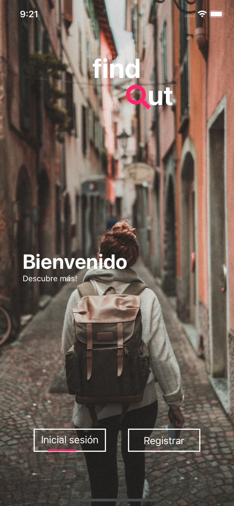
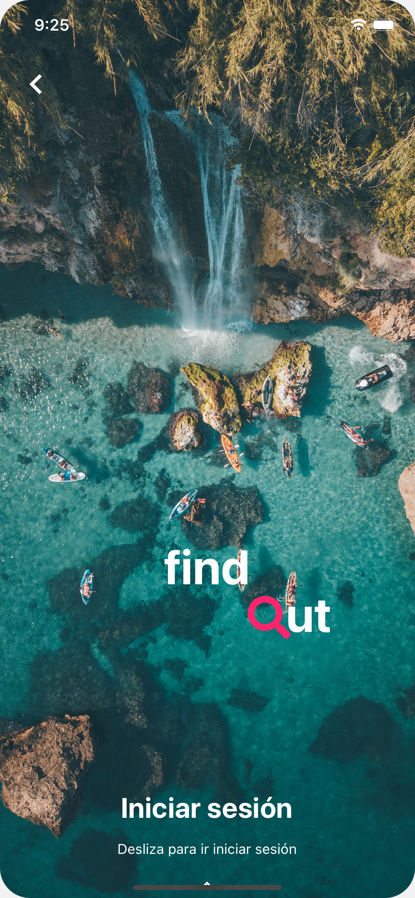
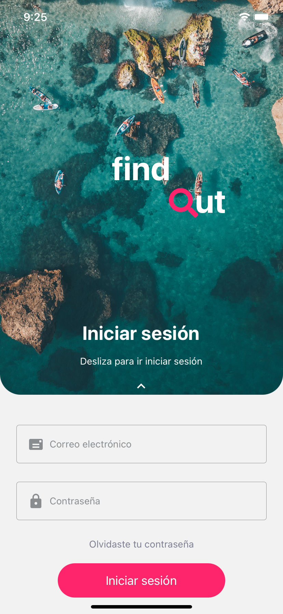
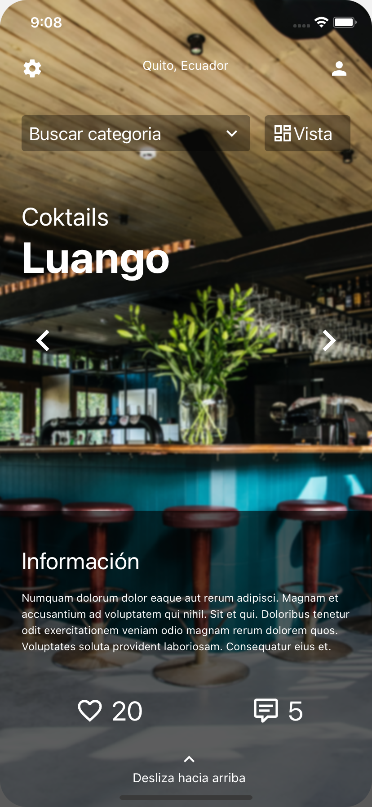
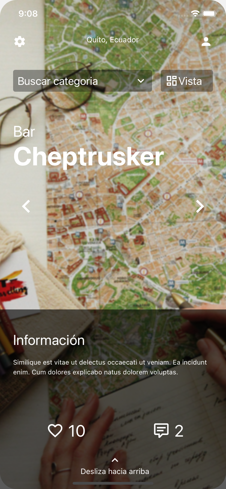
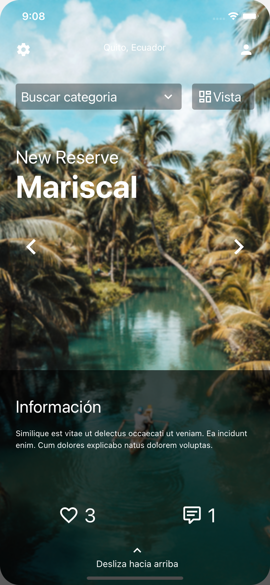
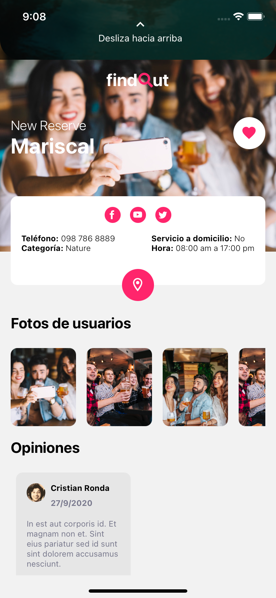

# Travels
This project was made for fun.
Is only for education.

Thanks for the design of Mauricio Lopez: [Link to XD](https://dribbble.com/shots/14208274-Travel-Places-UI?fbclid=IwAR2ohJykfCWeb3xMGoubgyJDnC3VxJn2GJ7oXUFGVXZA38sCLe2kk8DfqRQ)

# Screenshots
### Login

### Iniciar sesión

### Home

### Details

Give it fork, star 🌟  and improve this project, if you want 😁 
